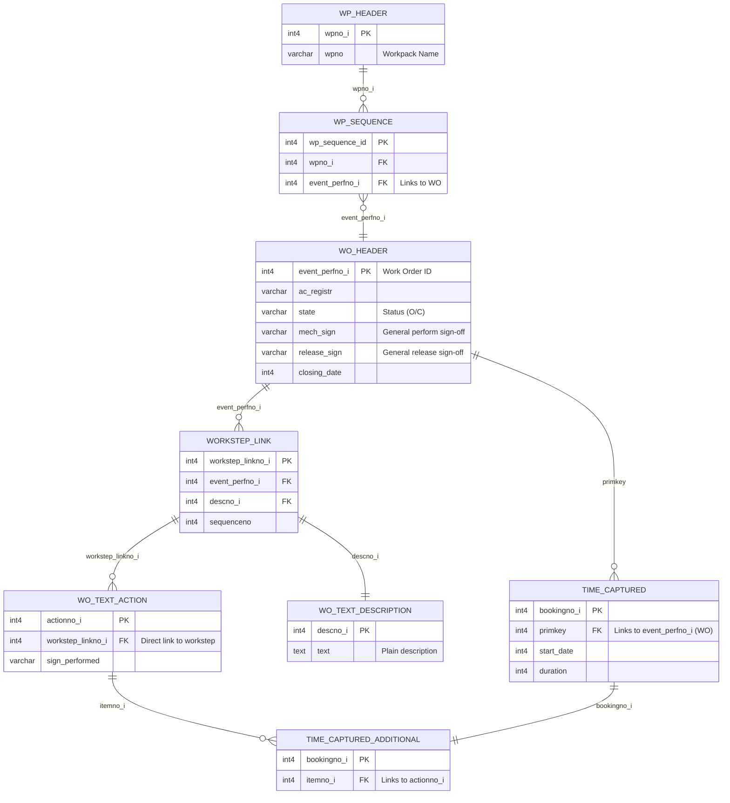

# Schema Verification: AMOS-WO.sql vs. CSV Extract

> **Status:** Partially Correct — requires minor adjustments to primary keys and foreign keys for precise querying.

## 1. What Each File Does
- **`AMOS-WO.sql`**: A simplified, manually curated subset of the database acting as a logical ERD (Entity-Relationship Diagram). It strips away the hundreds of irrelevant columns to focus purely on how a Timebooking traces back to a Workpack.
- **`Database-Description-AMOS-csv.csv`**: The literal, physical ground truth of the database structure exported from the AMOS system.

---

## 2. Verification Results & Corrections

After querying the CSV directly, I verified the tables. Most of the relationships mapped in the `.sql` file are functionally correct, but there are a few critical technical errors that will break actual SQL queries if we strictly followed the `.sql` file.

### 🔴 Error 1: Primary Key of `workstep_link`
- **In SQL file:** It claims `event_perfno_i` (the Work Order ID) is the Primary Key.
- **In CSV truth:** `workstep_linkno_i` is the Primary Key (`[P]`). `event_perfno_i` is merely a Foreign Key (`[U,U,I]`).
- **Impact:** A Work Order can have multiple work steps. If `event_perfno_i` were the PK, a Work Order could only have one step.

### 🔴 Error 2: The Phantom Junction Table
- **In SQL file:** It defines a table called `workstep_link_wo_text_action` to connect work steps to actions.
- **In CSV truth:** This table **does not exist**. Instead, the `wo_text_action` table natively contains `workstep_linkno_i` as a direct Foreign Key (Line 44713 in CSV).
- **Impact:** When querying, we do not need to JOIN through a junction table. We can JOIN `wo_text_action` directly to `workstep_link` using `workstep_linkno_i`.

---

## 3. The Verified Schema Map (Mermaid Diagram)

Here is the corrected entity relationship map based on the absolute truth of the CSV. You can use this safely to build your queries.

